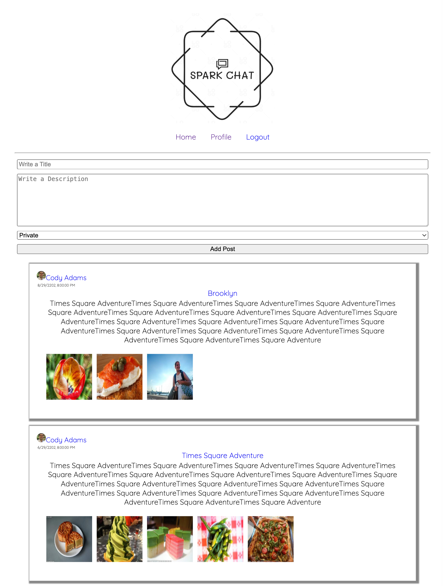

# Spark Chat

    
Description

    A Social Media Platform that lets users post with images.
    Users need to create an account in order to view public posts.
    They are able to create a post and add images with it and set the privacy to either public for everyone to see or private to serve as their own persona journal.
    Users are also able to take advantage of the message feature.
    The platform happens in realtime made possible by using Websocket and is designed using plain CSS and sample data is provided using Faker.

    
Tech Stack

    Javascript ||
    Express.js ||
    Node.js ||
    Git ||
    Webpack ||
    Babel ||
    React ||
    Redux ||
    Sequelize ||
    Bcrypt ||
    JSON Web Tokens ||
    Faker ||
    Websocket

## Landing Page

## Sign Up Page

## Feed Page

## Update Avatar Functionality

## Update Profile Functionality

## Profile Page

## Other User Page

## Message Functionality
